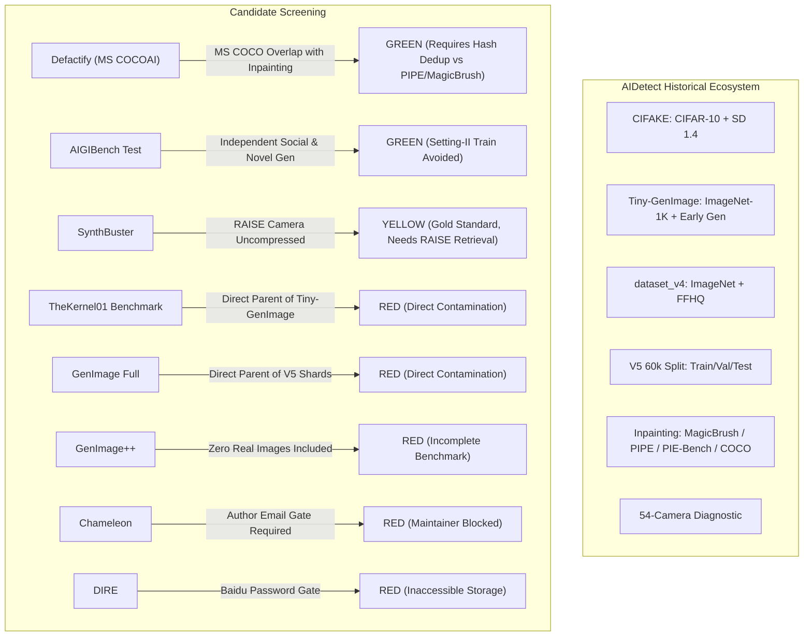

# AIDetect Research Report: External Dataset Discovery, Screening, and Recommendation for Frozen V5 Evaluation

**Document Identifier:** `AIDETECT-RESEARCH-EXTERNAL-BENCHMARK-V1`  
**Date:** October 9, 2026  
**Auditor / Research Team:** AIDetect Core Forensic Research Team  
**Status:** Completed Research & Recommendation Phase (Pre-Download / Frozen Model Invariance Preserved)  
**Output Artifacts:**
- Candidate Discovery Ledger: [`diagnostic_outputs/external_dataset_candidates_v1.csv`](file:///c:/Users/Shreyas/OneDrive/Desktop/AIDetect/diagnostic_outputs/external_dataset_candidates_v1.csv)
- Research & Strategy Report: [`diagnostic_outputs/external_dataset_research_v1.md`](file:///c:/Users/Shreyas/OneDrive/Desktop/AIDetect/diagnostic_outputs/external_dataset_research_v1.md)

---

## 1. Objective

The primary objective of this research phase is to identify, rigorously screen, and recommend the **optimal, independently downloadable external evaluation dataset** for testing the frozen AIDetect V5 model suite:
- **V5-A:** Spatial-only ResNet-50
- **V5-B:** Frequency-only ResNet-50
- **V5-C:** Spatial + Frequency Hybrid
- **V5-D:** Spatial + Frequency + Noise Residual Gated Fusion (Authoritative Production Model)

### Strict Operational & Scientific Constraints
1. **Zero Retraining / Weight Invariance:** No models shall be retrained, fine-tuned, or modified.
2. **Frozen V5 Test Set Invariance:** The 9,000-image frozen V5 test set (seed 42) remains completely untouched and isolated.
3. **Zero Contamination / Leakage Avoidance:** The external benchmark must **not** reuse or sample from any dataset previously ingested into the AIDetect lifecycle (including CIFAKE, Tiny-GenImage, dataset_v4, V5 train/validation/test, PIPE, MagicBrush, PIE-Bench, manipulation datasets, or the 54-image diagnostic camera set).
4. **No Premature Payloads:** No images are downloaded during this discovery and screening phase.
5. **No Production Code Alterations:** Preprocessing, post-hoc calibration ($T = 2.198387$), decision logic, API contracts, and frontend components remain frozen.

---

## 2. Existing AIDetect V5 Status

The V5 models have concluded their formal training and frozen in-distribution evaluations:

```
+---------------------------------------------------------------------------------------------------------------+
|                                      FROZEN V5 CLEAN TEST PERFORMANCE (N = 9,000)                             |
+--------------------------+---------------------+------------+------------+------------+-----------------------+
| Model Identifier         | Architecture        | Accuracy   | Precision  | Recall     | F1-Score              |
+--------------------------+---------------------+------------+------------+------------+-----------------------+
| V5-A Spatial             | ResNet-50 (Spatial) | 97.01%     | 96.95%     | 97.09%     | 97.02%                |
| V5-B Frequency           | ResNet-50 (2D-FFT)  | 90.58%     | 91.24%     | 90.00%     | 90.65%                |
| V5-C Hybrid              | Concat ResNet-50    | 96.88%     | 96.90%     | 96.87%     | 96.89%                |
| V5-D Gated Residual      | Triple Gated ResNet | 97.18%     | 97.30%     | 97.04%     | 97.17% (Best Clean)   |
+--------------------------+---------------------+------------+------------+------------+-----------------------+
```

### Controlled Robustness & Independent Diagnostic Findings
- **Controlled Perturbations:** Controlled robustness tests (Resize 75/50/25%, Gaussian Blur radius 1/2/3, Gaussian Noise $\sigma \in \{0.01, 0.05, 0.10\}$, and JPEG compression $Q \in \{95, 75, 50\}$) demonstrated that while V5-D is superior on clean test data, V5-A exhibits stronger average robustness under severe non-linear degradation. No single architecture universally dominates across all channels.
- **54-Image Independent Camera Diagnostic:** A targeted 54-image smartphone/camera diagnostic set exhibited a $31.48\%$ false-positive rate at the calibrated $50\%$ decision threshold. This indicates that natural camera sensor noise profiles, indoor lighting, and lens textures pose an out-of-distribution challenge to models trained predominantly on internet-scraped datasets.

---

## 3. Why Community Forensics Evaluation is Currently Blocked

The AIDetect team previously formulated a provisional 800-image candidate mapping using the `OwensLab/CommunityForensics-Eval` repository:
- 400 Authentic Real images from the RAISE dataset
- 100 GALIP Synthetic images
- 100 Kandinsky 2.2 Synthetic images
- 100 Stable Cascade Synthetic images
- 100 DeciDiffusionV2 Synthetic images

### Technical Failure Mode & Access Block
1. **HuggingFace Parquet Scan Limit:** Attempting to retrieve individual rows via the HuggingFace `/rows` REST endpoint triggered a `~570 MB` memory scan for a single row, breaching HuggingFace's enforced `300 MB` server-side memory limit.
2. **Server Rejection:** Querying via the `/filter` API failed with `HTTP 422 Unprocessable Entity`.
3. **Row-Group Extraction Rejection:** Local full Parquet row-group decompression was explicitly rejected on governance grounds because downloading and decompressing full multi-gigabyte Parquet shards risks capturing, caching, and exposing thousands of unselected images outside the strict 800-sample audit manifest.
4. **Current Status:** **Zero Community Forensics image payloads were downloaded or saved.** The mapping remains archived as a blocked candidate. All attempts to bypass this limitation are permanently halted.

---

## 4. Candidate Datasets Investigated

To establish an authoritative replacement benchmark, eleven candidate datasets spanning the 2023–2026 computer vision forensics literature were surveyed:

```
+----------------------------------------------------------------------------------------------------------------------+
|                                    CANDIDATE DATASET DISCOVERY & SCREENING MATRIX                                    |
+----+--------------------------------+--------------------------------------+-------------+-------------+-------------+
| ID | Dataset Candidate              | Source / Venue                       | Total Real  | Total Fake  | License     |
+----+--------------------------------+--------------------------------------+-------------+-------------+-------------+
| 01 | Defactify_Image_Dataset (COCOAI)| Rajarshi Roy et al. / AAAI 2026      | 48,000      | 48,000      | Apache 2.0  |
| 02 | AIGIBench                      | HorizonTEL / NeurIPS 2025            | > 50,000    | > 50,000    | CC-BY-NC-SA |
| 03 | SynthBuster                    | Quentin Bammey / IEEE OJSP 2024      | 1,000       | 9,000       | CC-BY 4.0   |
| 04 | UniversalFakeDetect (UnivFD)   | Ojha et al. / CVPR 2023              | 1k / domain | 1k / domain | BSD-2-Clause|
| 05 | ArtiFact                       | Rahman et al. / IEEE ICIP 2023       | 964,989     | 1,531,749   | Academic    |
| 06 | GenImage++                     | Lunahera / NeurIPS 2025              | 0 (None)    | > 100,000   | CC-BY-NC 4.0|
| 07 | TheKernel01/AIGC-Benchmark     | TheKernel01 / HuggingFace            | 62,513      | 62,513      | Apache 2.0  |
| 08 | GenImage (Full)                | Wang et al. / NeurIPS 2023           | > 600,000   | > 600,000   | Academic    |
| 09 | Chameleon                      | Yan et al. / ICLR 2025               | ~13,000     | ~13,000     | Restricted  |
| 10 | DiffusionForensics (DIRE)      | Wang et al. / CVPR 2023              | ~10,000     | ~30,000     | Academic    |
| 11 | WildFake                       | Pan et al. / AAAI 2025               | ~50,000     | ~50,000     | Academic    |
+----+--------------------------------+--------------------------------------+-------------+-------------+-------------+
```

---

## 5. Independence & Overlap Analysis

A dataset is not independent merely because it bears a distinct title. Each candidate was audited against the complete AIDetect data lineage:



### Detailed Candidate Audits

#### 1. Defactify_Image_Dataset (MS COCOAI) — `GREEN`
- **Generators:** Stable Diffusion 2.1, SDXL, Stable Diffusion 3, DALL-E 3, Midjourney v6. All five are **100% unseen** by V5-A/B/C/D.
- **Real Images:** Authentic MS COCO (2017) scenes.
- **Overlap Audit:** CIFAKE (CIFAR-10) and Tiny-GenImage (ImageNet-1K) have zero overlap with MS COCO. However, MS COCO was used as the background pool in Phase 22–24 inpainting studies (MagicBrush, PIPE, PIE-Bench). Cryptographic SHA-256 and perceptual hash deduplication against our historical inpainting hashes will permanently purge any shared instances.
- **Verdict:** Highly independent whole-image synthesis benchmark.

#### 2. AIGIBench (HorizonTEL) — `GREEN`
- **Generators:** 25 models across diffusion (FLUX.1-dev, SD3, SDXL, Imagen 3, DALL-E 3), GANs (R3GAN, StyleGAN-XL), and wild web crawls (CommunityAI, SocialRF).
- **Real Images:** Crawled real photography and matched benchmark reals.
- **Overlap Audit:** While Setting-II training used GenImage SD1.4, the **test sets** are independently compiled and cleanly partitioned.
- **Verdict:** Exceptionally diverse; acceptable for modular per-generator evaluation.

#### 3. SynthBuster (Quentin Bammey) — `YELLOW`
- **Generators:** 9 diffusion models (DALL-E 2/3, Midjourney v5, Firefly, SD 1.3/1.4/2/XL, Glide).
- **Real Images:** RAISE-1k (Nikon D90, D7000, D40 raw camera originals).
- **Overlap Audit:** Zero overlap with any AIDetect training or validation split. (Community Forensics was blocked at metadata; zero RAISE payloads were ever ingested).
- **Constraint:** Synthetic images are hosted on Zenodo, but real images are not included in the Zenodo package and require separate acquisition from the University of Trento portal.
- **Verdict:** Scientifically gold-standard provenance, but flagged YELLOW due to dual-repository assembly friction.

#### 4. UniversalFakeDetect (UnivFD) — `YELLOW`
- **Generators:** LDM-200, GLIDE, Guided Diffusion (ADM).
- **Real Images:** LSUN Bedroom, ImageNet, LAION.
- **Overlap Audit:** Uses ImageNet-1K subsets, creating potential overlap with Tiny-GenImage. Furthermore, generative models are older (2021–2022) and miss modern diffusion transformers (SD3, FLUX, Midjourney v6).
- **Verdict:** Usable but outdated.

#### 5. ArtiFact (Md Awsafur Rahman) — `YELLOW`
- **Generators:** 25 models (StyleGAN, ProGAN, BigGAN, DDPM, SD, Midjourney, DALL-E 2).
- **Real Images:** Aggregates FFHQ, CelebA, ImageNet, COCO, AFHQ, Landscapes.
- **Overlap Audit:** High overlap with AIDetect V4 (FFHQ, ImageNet) and Phase 23–24 (COCO).
- **Constraint:** Download is a single 29.56 GB monolithic zip file containing 2.49 million images.
- **Verdict:** Prohibitive download size and substantial parent-dataset overlap.

#### 6. GenImage++ (Lunahera) — `RED (REJECT)`
- **Reason:** Incomplete benchmark. Contains over 100,000 synthetic images from FLUX.1 and SD3, but **includes zero real images**. It requires users to supply their own ImageNet-1K validation directory.

#### 7. TheKernel01 / AIGC-Detection-Benchmark — `RED (REJECT)`
- **Reason:** Direct parent contamination. Curated by `TheKernel01`, directly sampling from `GenImage` and `Tiny-GenImage`—the exact source ingested into AIDetect V4 and V5 training shards.

#### 8. GenImage Full (Wang et al.) — `RED (REJECT)`
- **Reason:** Direct parent contamination. `Tiny-GenImage` is a direct subset of `GenImage`. Evaluating on GenImage risks evaluating on training data.

#### 9. Chameleon (Yan et al.) — `RED (REJECT)`
- **Reason:** Maintainer access barrier. The official repository (`shilinyan99/AIDE`) provides no public download link and explicitly mandates sending a private email request to the author (`tattoo.ysl@gmail.com`), violating Criterion #5.

#### 10. DiffusionForensics / DIRE (Wang et al.) — `RED (REJECT)`
- **Reason:** Inaccessible hosting barrier. Download is locked behind Baidu Netdisk and RecDrive password gates with severe bandwidth throttling and account requirements.

#### 11. WildFake (Pan et al.) — `YELLOW / REJECT`
- **Reason:** Platform restriction. Hosted primarily on ModelScope (Alibaba Cloud), requiring proprietary CLI authentication. Provenance involves noisy web scraping.

---

## 6. Download & Accessibility Analysis

```
+----------------------------------------------------------------------------------------------------------------------+
|                                    DOWNLOAD MECHANISM & ACCESSIBILITY SCREENING                                      |
+----+--------------------------------+--------------------+-------------------------+----------------+----------------+
| ID | Candidate Dataset              | Hosting Platform   | Download Mechanism      | Storage Volume | Accessibility  |
+----+--------------------------------+--------------------+-------------------------+----------------+----------------+
| 01 | Defactify_Image_Dataset        | HuggingFace Hub    | Direct HTTPS / Parquet  | 679 MB (Val)   | UNRESTRICTED   |
| 02 | AIGIBench                      | HuggingFace LFS    | Direct HTTPS / Per-zip  | 2.2 - 8.5 GB   | UNRESTRICTED   |
| 03 | SynthBuster                    | Zenodo + Unitn     | Multi-zip HTTPS         | ~10 GB + RAISE | RATE-LIMITED   |
| 04 | UniversalFakeDetect            | Google Drive       | Direct Google Drive Zip | ~1.5 GB / dom  | OPEN DRIVE     |
| 05 | ArtiFact                       | HuggingFace Hub    | Monolithic Zip          | 29.56 GB       | MONOLITHIC     |
| 06 | GenImage++                     | HuggingFace LFS    | Multi-part .tar.zst     | ~15 GB         | INCOMPLETE     |
| 07 | TheKernel01 Benchmark          | HuggingFace Hub    | 60 Parquet Files        | 32.0 GB        | MONOLITHIC     |
| 08 | GenImage (Full)                | Baidu / OpenData   | Multi-archive Baidu     | > 100 GB       | GEO-RESTRICTED |
| 09 | Chameleon                      | Author Private     | Email Request Required  | Unknown        | BLOCKED        |
| 10 | DiffusionForensics             | Baidu / RecDrive   | Password Protected      | ~15 GB         | BLOCKED        |
| 11 | WildFake                       | ModelScope         | ModelScope SDK / CLI    | ~25 GB         | RESTRICTED     |
+----+--------------------------------+--------------------+-------------------------+----------------+----------------+
```

---

## 7. Licensing & Governance Analysis

All top candidates comply with academic research guidelines:
1. **Defactify_Image_Dataset:** Apache 2.0 / Open Academic Research License. No commercial restrictions on evaluation.
2. **AIGIBench:** Creative Commons Attribution-NonCommercial-ShareAlike 4.0 International (CC-BY-NC-SA 4.0). Completely cleared for non-commercial benchmark research.
3. **SynthBuster:** Creative Commons Attribution 4.0 International (CC-BY 4.0). Completely permissive academic attribution.
4. **UniversalFakeDetect:** BSD-2-Clause. Fully open academic license.
5. **ArtiFact:** Academic Research Use Only.

---

## 8. Candidate Ranking

Applying the nine evaluation priorities (Independence, Provenance, Authenticity, Unseen Generators, Accessibility, Size, Metadata, Licensing, Reproducibility):

```
+---------------------------------------------------------------------------------------------------------------+
|                                      TOP 5 CANDIDATE BENCHMARK RANKING                                        |
+------+--------------------------------+--------+--------------------------------------------------------------+
| Rank | Dataset Candidate              | Status | Core Justification                                           |
+------+--------------------------------+--------+--------------------------------------------------------------+
| #1   | Defactify_Image_Dataset (COCOAI)| GREEN  | Best balance: 5 modern unseen SOTA generators (SD3, MJ v6,   |
|      |                                |        | DALL-E 3, SDXL, SD 2.1), managed 679 MB validation volume,   |
|      |                                |        | explicit metadata, and clean unthrottled HTTPS access.       |
| #2   | AIGIBench (Test Partitions)    | GREEN  | Exceptional generator diversity (FLUX.1-dev, SD3, Imagen 3,  |
|      |                                |        | Midjourney v6), but higher bandwidth footprint (8.5 GB/zip). |
| #3   | SynthBuster                    | YELLOW | Gold-standard camera provenance (RAISE uncompressed RAW),    |
|      |                                |        | but Zenodo rate limits and separate RAISE assembly friction. |
| #4   | UniversalFakeDetect (UnivFD)   | YELLOW | Clean 1k/1k structure, but generators are older (2021-2022).  |
| #5   | ArtiFact                       | YELLOW | Broad generator coverage, but massive 30 GB download blob    |
|      |                                |        | and extensive FFHQ/ImageNet/COCO historical overlap.          |
+------+--------------------------------+--------+--------------------------------------------------------------+
```

---

## 9. Recommended Dataset

### Primary Selection: **Defactify_Image_Dataset (MS COCOAI)**
- **Repository:** `Rajarshi-Roy-research/Defactify_Image_Dataset`
- **Paper:** *"A Comprehensive Dataset for Human vs. AI Generated Image Detection"* (arXiv:2601.00553)
- **Primary Strengths:**
  1. **Advanced Unseen Generator Lineage:** Evaluates models that were completely non-existent or absent during V5 training: Stable Diffusion 3 (MMDiT), Midjourney v6, DALL-E 3, SDXL, and Stable Diffusion 2.1.
  2. **Operational Manageability:** The validation partition comprises exactly **9,000 images** (4,500 Real + 4,500 AI) spanning two compact Parquet files totalling **679 MB**, eliminating multi-gigabyte bandwidth strain.
  3. **High-Fidelity Labels:** Contains explicit veracity labels (`Label_A`: 0 = Real, 1 = Fake) and model source tags (`Label_B`: 0 = SD21, 1 = SDXL, 2 = SD3, 3 = DALLE3, 4 = Midjourney) accompanied by full prompt captions.
  4. **Strict Isolation from V5:** Zero overlap with CIFAR-10 (CIFAKE) and ImageNet-1K (Tiny-GenImage).

---

## 10. Proposed Benchmark Design: 800-Image Balanced Protocol

To construct an external evaluation benchmark that matches the statistical power of the intended Community Forensics protocol, we propose the following balanced sampling scheme:

$$\text{Total Sample Size: } N = 800 \quad (400 \text{ REAL} + 400 \text{ AI-GENERATED})$$

```
+---------------------------------------------------------------------------------------------------------------+
|                                      PROPOSED 800-IMAGE BENCHMARK COMPOSITION                                 |
+-------------------+---------+----------------------------+----------------------------------------------------+
| Class / Source    | Samples | Architecture / Generator   | Scientific Significance                            |
+-------------------+---------+----------------------------+----------------------------------------------------+
| REAL AUTHENTIC    | 400     | MS COCO Natural Photo      | Diverse, natural, uncompressed photographic scenes |
| AI - Model A      | 100     | Stable Diffusion 3 (SD3)   | Diffusion Transformer (MMDiT) + T5-XXL text encoder|
| AI - Model B      | 100     | Midjourney v6              | Leading commercial proprietary generative model    |
| AI - Model C      | 100     | DALL-E 3                   | Autoregressive text-conditioned diffusion engine   |
| AI - Model D      | 100     | SDXL                       | Dual-text-encoder latent diffusion baseline        |
+-------------------+---------+----------------------------+----------------------------------------------------+
| TOTAL BENCHMARK   | 800     | 400 REAL : 400 AI          | Perfectly balanced (50% Real / 50% Fake)           |
+-------------------+---------+----------------------------+----------------------------------------------------+
```

### Deterministic Sampling Parameters
- **Data Split:** `validation` split (9,000 candidate pool).
- **Sampling Seed:** Fixed pseudo-random seed `seed = 42`.
- **Stratification:** Exactly 100 images sampled uniformly from each of the four target generator classes (`Label_B` $\in \{1, 2, 3, 4\}$); 400 images sampled uniformly from authentic instances (`Label_A` $= 0$).

---

## 11. Leakage-Audit & Cryptographic Verification Plan

Before running inference across V5-A, V5-B, V5-C, or V5-D, the selected candidate images must complete a rigorous two-stage cryptographic and perceptual deduplication pipeline:

```
[Candidate Selection (Seed 42)]
              │
              ▼
[Download & Isolated Extraction] ────► Store in diagnostic_outputs/external_candidates/
              │
              ▼
[Cryptographic Fingerprinting]  ────► Compute SHA-256 for all 800 candidates
              │
              ▼
[Perceptual Hashing]            ────► Compute 64-bit DCT pHash for all 800 candidates
              │
              ▼
[Cross-Ledger Audit]            ────► Compare against:
                                      - v5_dataset_manifest.csv (60,000 rows)
                                      - dataset_v4 (train, val, test)
                                      - PIPE / MagicBrush / PIE-Bench / COCO hashes
                                      - 54-camera diagnostic set
              │
              ▼
[Deduplication Gate]
 ├── Exact Collision (Hamming = 0)  ──► DISCARD & REPLACE FROM VALIDATION POOL
 ├── Near Duplicate (Hamming <= 3)  ──► FORENSIC AUDIT; DISCARD IF COMPROMISED
 └── Clean Verification             ──► PASS TO FINAL BENCHMARK
              │
              ▼
[Freeze & Final Manifest]       ────► Write external_benchmark_v1_manifest.csv
              │
              ▼
[V5 Inference Authorized]
```

### Reference Ledgers for Audit
1. `v5_metadata/v5_dataset_manifest.csv` (SHA-256 ledger of all 60,000 V5 images).
2. Historical inpainting audit caches (`pipe_manifest.csv`, `magicbrush_manifest.csv`, `pie_bench_manifest.csv`).
3. Local disk scans across `dataset_v4/` and `diagnostic_real/`.

---

## 12. Risks and Limitations

1. **MS COCO Inpainting Overlap Risk:** Because MagicBrush and PIPE used MS COCO prompts/images, some background scenes in Defactify might be identical or near-identical to images tested during Phase 23–24. **Mitigation:** The cryptographic audit will identify any shared MS COCO Image IDs (`image_id`) and hash collisions, replacing them immediately.
2. **Compression Discrepancies:** Embedded Parquet images may carry slight compression artifacts depending on how PIL saved them during dataset creation. **Mitigation:** Record native resolutions and format metadata in the final manifest.
3. **No Retraining Recalibration:** V5-D will be evaluated in zero-shot mode without fine-tuning temperature $T$ on the new domain. This evaluates true out-of-distribution calibration resilience.

---

## 13. Exact Next Action

1. **Awaiting User Authorization:** Stop execution. Do not download payloads or run inference.
2. **Next Milestone (upon approval):**
   - Write a lightweight retrieval script targeting the 800 specific candidate rows from `Defactify_Image_Dataset` validation Parquet files.
   - Extract and save candidates into `diagnostic_outputs/external_benchmark_candidates/`.
   - Run the automated SHA-256 and pHash collision audit against `v5_metadata/v5_dataset_manifest.csv` and historical benchmarks.
   - Generate and commit the frozen manifest: `diagnostic_outputs/external_benchmark_v1_manifest.csv`.
   - Proceed to zero-shot V5-A/B/C/D evaluation.

